# taiwan-stock-monitor
自動化台股全方位監控系統：每日產出 9 張（週/月/年 × 高/收/低）10% 分箱報酬分析圖表，並透過 Resend API 發送互動式電子郵件報表。  Automated Taiwan Stock Monitor: Generates 9 comprehensive charts (Week/Month/Year × High/Close/Low) with 10% bin return analysis, delivering interactive daily email reports via Resend API.

# 🇹🇼 Taiwan Stock Multi-Matrix Monitor | 台股全方位矩陣監控系統

[English](#english) | [中文](#中文)

---

## English

### 🚀 Project Overview
A fully automated Taiwan stock market monitoring system that performs multi-threaded data scraping, statistical matrix analysis, and professional reporting. The system visualizes market breadth and momentum through a 3x3 distribution matrix (Week/Month/Year K-line vs. High/Close/Low price).

### 🛠️ Key Features
- **Auto-Scraping**: Automatically fetches all listed/OTC/ETF/Innovation Board tickers from TWSE.
- **Data Pipeline**: Multi-threaded historical data downloading via `yfinance`.
- **Matrix Analysis**: Generates 9 distinct distribution charts showing market health.
- **Smart Reporting**: Sends professional HTML emails via **Resend API**, featuring color-coded tables and direct links to **WantGoo Technical Charts**.
- **GitHub Actions**: 100% serverless, scheduled execution (CST 13:30/14:00).

### 🧰 Tech Stack
- **Language**: Python 3.10
- **Libraries**: Pandas, Matplotlib, Requests, Concurrent.futures, Tqdm
- **Automation**: GitHub Actions
- **Infrastructure**: Ubuntu-latest (with CJK Font support)

---

## 中文

### 🚀 專案概述
一個完全自動化的台股監控系統，執行多執行緒數據爬取、矩陣統計分析並寄送專業報表。系統透過 3x3 分佈矩陣（週/月/年K 結合 最高/收盤/最低價）視覺化呈現市場漲跌家數與進攻力道。

### 🛠️ 核心功能
- **自動爬蟲**：自動從證交所抓取所有上市、上櫃、ETF 及創新板代號。
- **數據管線**：透過 `yfinance` 進行多執行緒歷史數據下載。
- **矩陣分析**：生成 9 張分佈圖表，完整呈現市場健康狀態。
- **專業報表**：透過 **Resend API** 寄送 HTML 郵件，包含彩色排版表格與直達 **玩股網技術線圖** 的超連結。
- **雲端自動化**：完全基於 GitHub Actions，定時觸發執行（台北時間 13:30/14:00）。

### 🧰 技術棧
- **程式語言**：Python 3.10
- **函式庫**：Pandas, Matplotlib, Requests, Concurrent.futures, Tqdm
- **自動化**：GitHub Actions
- **基礎設施**：Ubuntu-latest (支援 CJK 中文字體安裝)

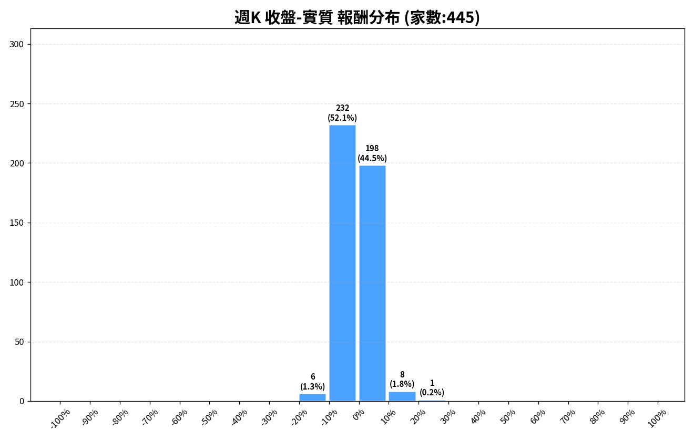

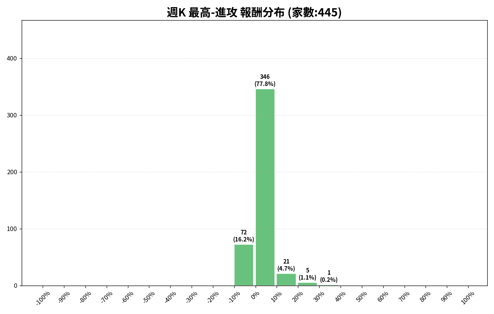

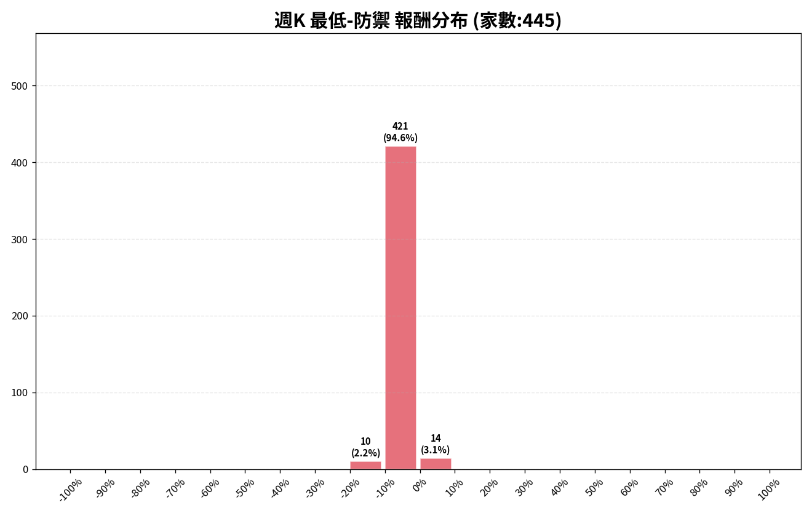

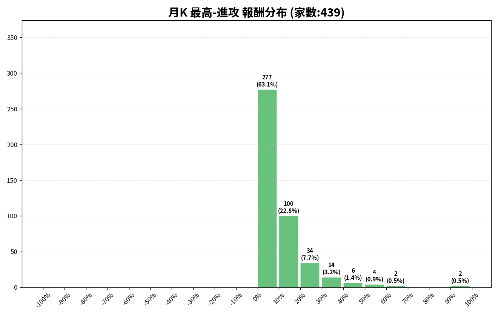

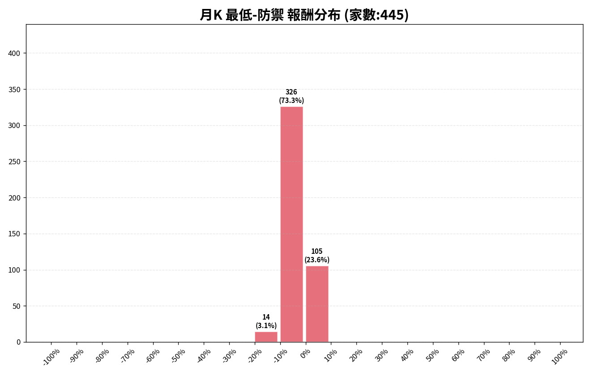

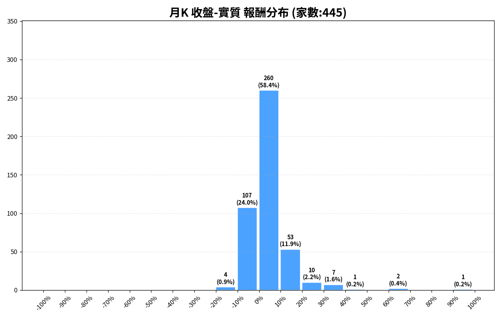

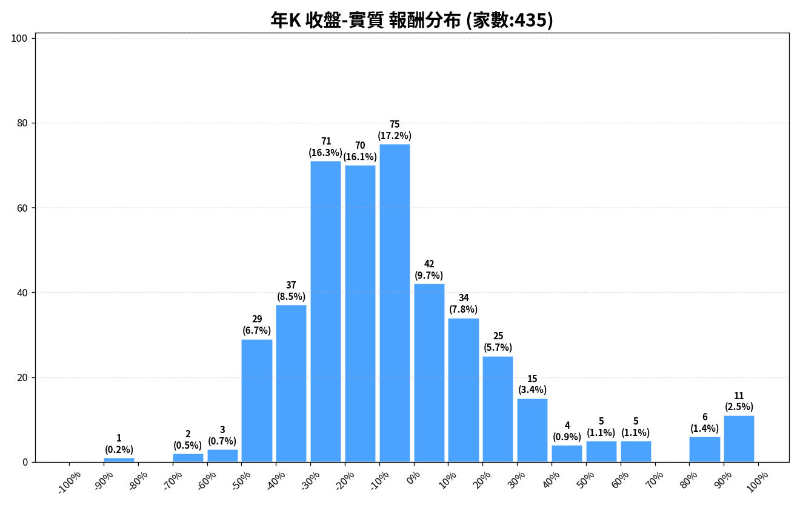

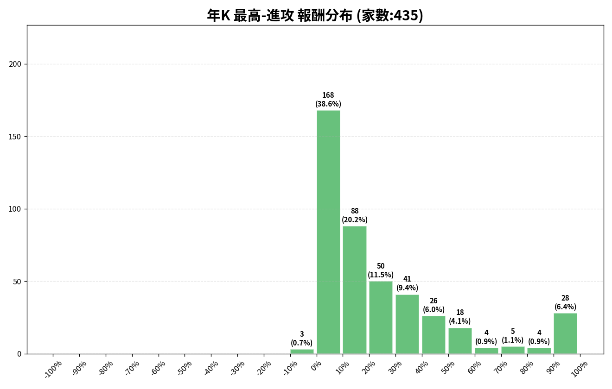

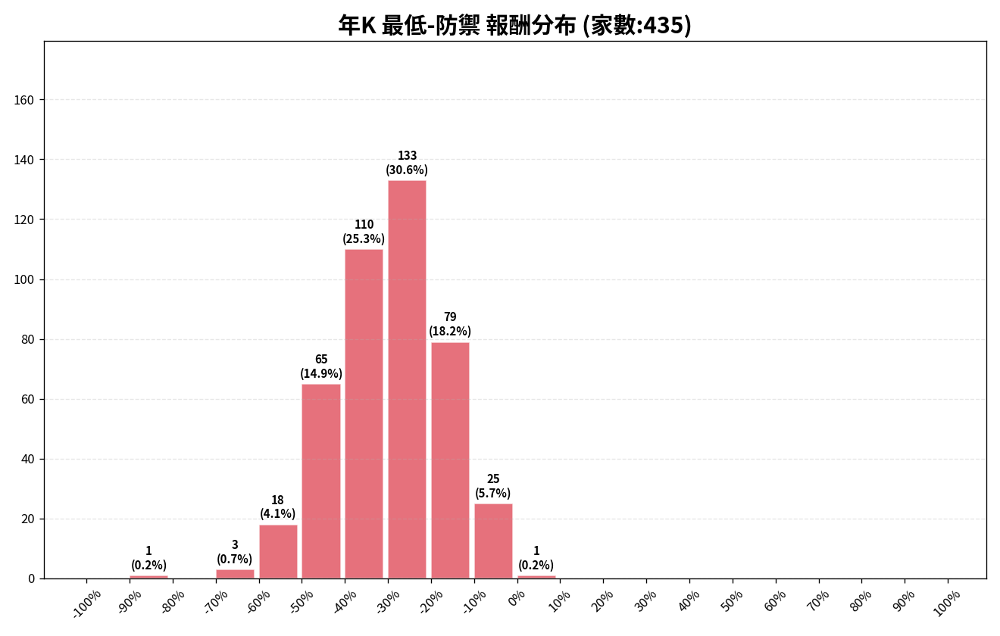

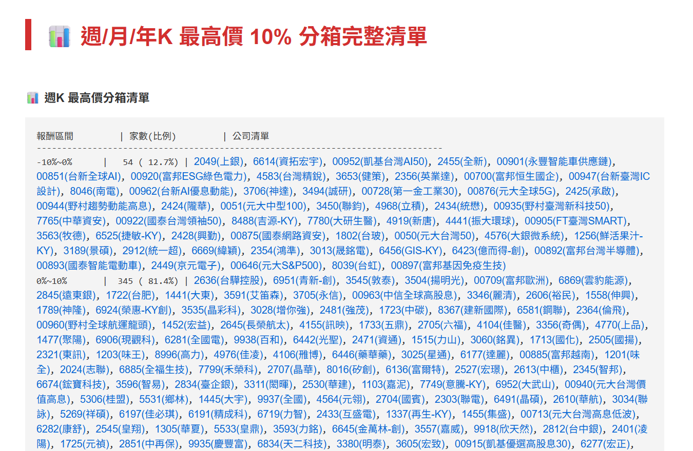

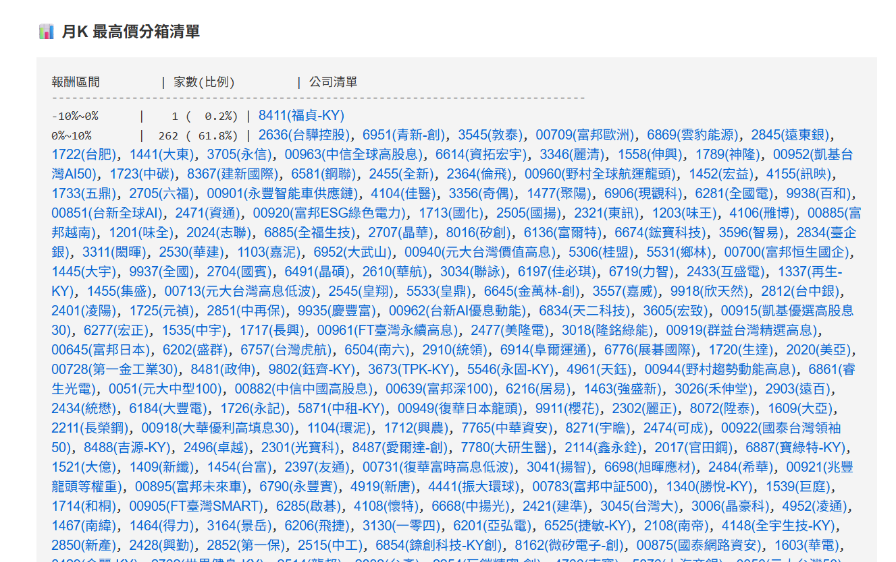

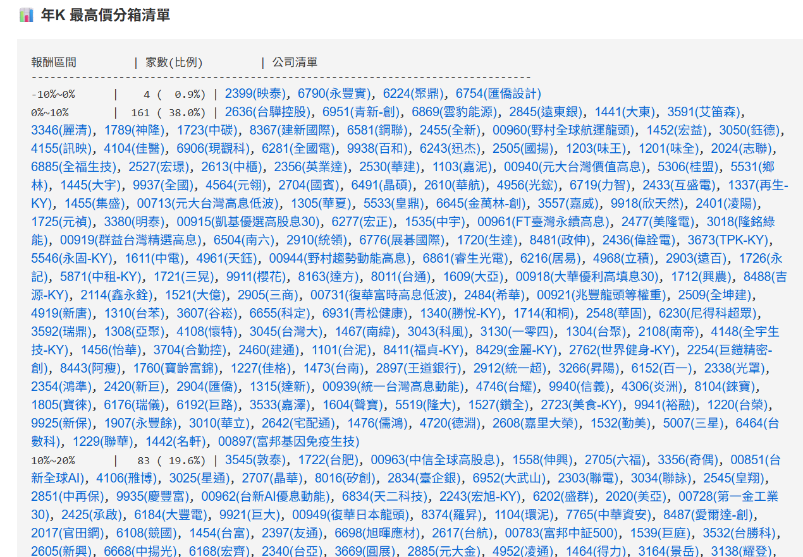

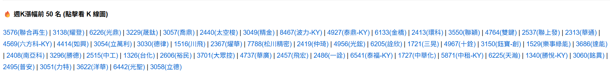

